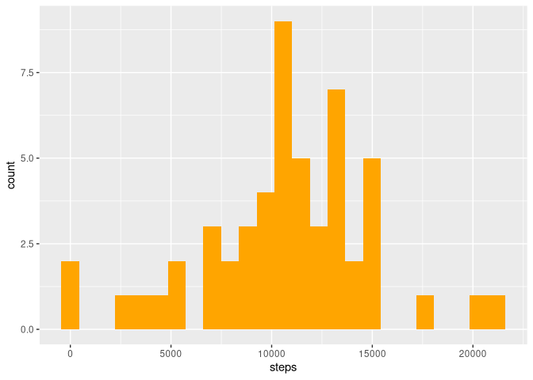
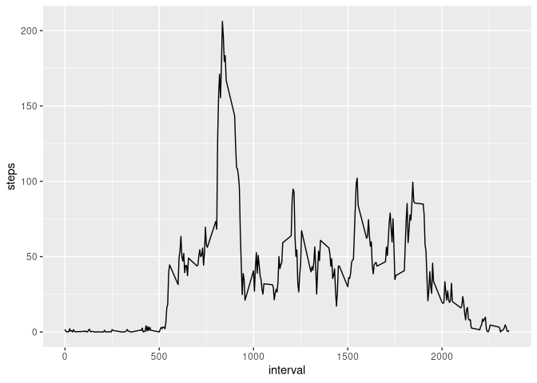
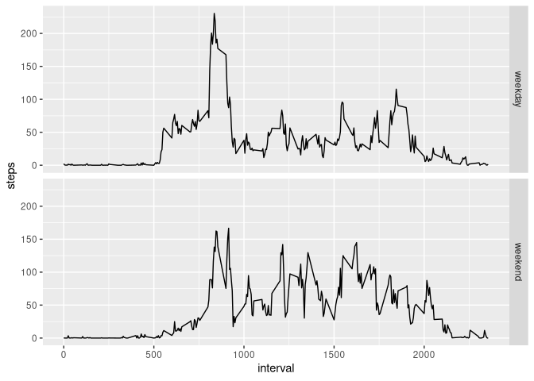

# Reproducible Research: Peer Assessment 1


## Loading and preprocessing the data

First loaded needed libraries. Then unzipped the zip file using `unzip()`. 
After that loaded the data using `read.csv()`


```r
library(ggplot2)
unzip("activity.zip")
dat <- read.csv("activity.csv")
dat$date <- as.Date(dat$date)
head(dat)
```

```
##   steps       date interval
## 1    NA 2012-10-01        0
## 2    NA 2012-10-01        5
## 3    NA 2012-10-01       10
## 4    NA 2012-10-01       15
## 5    NA 2012-10-01       20
## 6    NA 2012-10-01       25
```

## What is mean total number of steps taken per day?

Found out total number of steps taken per day using `aggregate()`. Then plotted 
a histogram of number of steps taken per day using `ggplot()`


```r
totalsteps <- aggregate(steps ~ date, dat, sum)
g1 <- ggplot(totalsteps, aes(steps))
p1 <- g1 + geom_histogram(bins = 25, fill = "orange")
print(p1)
```

<!-- -->

Mean and meadian can be found out using `mean()` and `median()`

```r
mean(totalsteps$steps)
```

```
## [1] 10766.19
```

```r
median(totalsteps$steps)
```

```
## [1] 10765
```

Here mean = 10766.19 and median = 10765

## What is the average daily activity pattern?

We can find out average value of steps taken per interval by using `aggregate()`


```r
avgsteps <- aggregate(steps ~ interval, dat, mean)
head(avgsteps)
```

```
##   interval     steps
## 1        0 1.7169811
## 2        5 0.3396226
## 3       10 0.1320755
## 4       15 0.1509434
## 5       20 0.0754717
## 6       25 2.0943396
```

Now from this data frame we can plot average value per interval as a time series
using `ggplot()`


```r
g2 <- ggplot(avgsteps, aes(interval, steps))
p2 <- g2 + geom_line()
print(p2)
```

<!-- -->

We can also find which interval has the maximum average steps taken 


```r
avgsteps[which.max(avgsteps$steps),]$interval
```

```
## [1] 835
```
This means the interval 830 to 835 has the maximum step count.

## Imputing missing values

For all the missing values, just the average step count corresponding to their 
interval is taken. Total number of missing values are


```r
sum(is.na(dat$steps))
```

```
## [1] 2304
```

There are 2304 missing values. We create a new data frame and replace missing
values.


```r
datnew <- dat
for (i in 1:nrow(datnew)) {
    if (is.na(datnew$steps[i])) {
        datnew$steps[i] <- avgsteps[datnew$interval[i] == avgsteps$interval,2]
            }
}
head(datnew)
```

```
##       steps       date interval
## 1 1.7169811 2012-10-01        0
## 2 0.3396226 2012-10-01        5
## 3 0.1320755 2012-10-01       10
## 4 0.1509434 2012-10-01       15
## 5 0.0754717 2012-10-01       20
## 6 2.0943396 2012-10-01       25
```

As we can see, first few values were missing in the original data set and now
its filled. We can plot a histogram like before, this time without missing 
values


```r
totalstepsnew <- aggregate(steps ~ date, datnew, sum)
g3 <- ggplot(totalsteps, aes(steps))
p3 <- g1 + geom_histogram(bins = 25, fill = "orange")
print(p3)
```

<!-- -->

And can also find mean and median like before


```r
mean(totalstepsnew$steps)
```

```
## [1] 10766.19
```

```r
median(totalstepsnew$steps)
```

```
## [1] 10766.19
```

Mean is the same as the last time since we used a mean value to fill the missing
values. But median is a little different because it depends on which values were
missing.


## Are there differences in activity patterns between weekdays and weekends?

For this, first we have to create a new variable which differentiates between
weekdays and weekends. For this we can use `weekdays()` function on date 
variable and separate them accordingly


```r
for (i in 1:nrow(datnew)) {
    if(weekdays(datnew$date[i]) == "Sunday" | 
       weekdays(datnew$date[i]) == "Saturday") {
        datnew$day[i] <- "weekend"
    }else datnew$day[i] <- "weekday"
}
head(datnew)
```

```
##       steps       date interval     day
## 1 1.7169811 2012-10-01        0 weekday
## 2 0.3396226 2012-10-01        5 weekday
## 3 0.1320755 2012-10-01       10 weekday
## 4 0.1509434 2012-10-01       15 weekday
## 5 0.0754717 2012-10-01       20 weekday
## 6 2.0943396 2012-10-01       25 weekday
```
A new column is visible on the data set. Now we can use `ggplot()` to create a 
plot like this


```r
g4 <- ggplot(datnew, aes(interval, steps))
p4 <- g4 + geom_line(stat = "summary", fun = "mean") +  facet_grid(day ~ .)
print(p4)
```

<!-- -->
